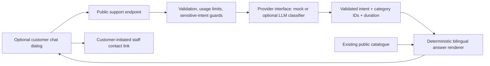

# Phase 2 — Read-only bilingual customer support

Implementation date: 19 September 2026. Local demo only; no push or deployment.

## Status and scope

The customer booking page now has an optional **Ask about services / 咨询疗程** chat button. It supports English, Chinese and mixed-language questions, catalogue prices, treatment descriptions, add-ons and recent-question follow-ups. The default mode is explicitly labelled **DEMO · Scripted replies, not a live AI**.

An optional server-side OpenAI Responses adapter is implemented behind a small provider interface. **No real model credentials were configured, no paid requests were made, and real-model accuracy has not been validated.** Mock tests establish deterministic application behavior, not an LLM's understanding or safety.

This is not autonomous booking, an agent orchestrator, WhatsApp integration, payments or analytics. The existing shop WhatsApp URL is only a human-contact link: no chat transcript is prefilled or automatically sent. The chat cannot create or confirm a booking.

## Current-code inspection and baseline

- Git revision at the start: `6207d022cc416aff3536d32149e9f522b79b8eed`.
- Existing uncommitted Phase 1 changes and the audit/stabilisation documents were preserved. They were not assumed to be committed or reimplemented.
- Frontend: React 19, Next.js conventions, Vinext/Vite. `/` renders `app/booking-wizard.tsx`; `/staff` and `/boss` remain separate customer-service and owner workspaces.
- API: `scripts/demo-server.ts`, Node HTTP, listening on loopback port 4311. Vite proxies `/api/demo` from port 3000 to it.
- Database: Node's SQLite implementation, existing `.demo-data/demo.sqlite`, aggregate booking state, authentication/session/idempotency tables, and separate owner-finance state. Booking writes still use their existing transaction and idempotency logic.
- Existing authorization: local HttpOnly staff sessions, role checks for owner/receptionist/therapist operations, server-side historical financial projection, public anonymous occupancy and customer receipt capabilities. None are supplied to the support module.
- Startup: `npm run demo` runs `scripts/dev-demo.mjs`, which starts the API and then the frontend. `npm run dev` alone does not start the API.
- Catalogue: bilingual categories, treatment/package names, add-ons and actual prices are in `app/catalog.ts`. Operational scheduling settings are explicitly marked demo estimates.
- No existing chatbot, LLM adapter, embedding store or agent infrastructure was found in application/server code. No model SDK dependency or configured provider credential was found. Credential checks printed presence only, never values.
- Before edits: **76 tests passed, 0 failed, 0 skipped**; TypeScript and ESLint both passed.

## Architecture



There is intentionally no edge from support to booking transactions, live occupancy, staff APIs, private records or owner finance. `support-knowledge.ts` imports public catalogue data, not `demo-booking.ts` or a database. `support-service.ts` has no database handle or authenticated-user object.

### What uses an LLM

In `openai` mode only, the model interprets natural-language intent, category references and duration. It returns a constrained JSON object:

```json
{"intent":"prices","categories":["thai"],"minutes":90}
```

The model cannot return displayed prose, prices, URLs or executable tool calls. The server validates its output against allowed intents, existing category IDs and durations. Unexpected fields, unknown IDs, refusal/incomplete output or malformed JSON fail safely. There are no model tools.

The final answer is always rendered by normal application code from current catalogue values and bilingual safety/handoff templates. This intentionally trades open-ended fluency for a narrow, verifiable support surface. Adding another provider means implementing `SupportProvider.interpret(request, signal)`; catalogue behavior and UI do not need to change.

In `mock` mode, bilingual keyword matching resolves the same structured query. It makes **no external requests** and is not a real LLM.

The adapter uses native Node `fetch`; no SDK, framework, vector database, embedding pipeline or new dependency was installed. Structured output follows [official OpenAI documentation](https://developers.openai.com/api/docs/guides/structured-outputs). Requests specify `store: false`; this is not a promise of zero provider-side retention. Review the provider's [data controls](https://developers.openai.com/api/docs/guides/your-data) before sending real customer text.

## Public API

### GET `/api/demo/support/config`

Returns only `{ "enabled": true, "mode": "mock" }` (or `openai` / `disabled`). It never returns model credentials or staff information. A disabled mode hides the widget after configuration loads.

### POST `/api/demo/support`

Requires `Content-Type: application/json` and the existing local `X-Demo-Client: serene-local` convention. If an Origin is supplied, it must be the local frontend origin on port 3000. Browser requests omit cookies; this endpoint does not interpret staff sessions.

Request:

```json
{
  "message": "那90分钟的呢？",
  "history": ["How much is Thai massage?"],
  "locale": "zh"
}
```

Only these three fields are accepted. `history` is a bounded list of prior customer questions, never client-supplied system/assistant messages. Client history remains untrusted; it grants no permissions and is not a source for prices or policies.

Response fields:

- `text`: plain text, rendered from the catalogue or support templates.
- `locale`: reply language; Chinese text selects Chinese, otherwise the website locale is used.
- `mode`: identifies demo versus real-provider interpretation.
- `handoff`: suggests contacting staff.
- `bookingLink`: offers a button that closes chat and returns to the existing, unchanged booking form.
- `sources`: `app/catalog.ts` for catalogue answers; empty for handoffs.

Errors contain only stable codes, not upstream payloads or user messages: invalid requests 400, invalid client/origin 403, unsupported method 405, body timeout 408, oversized body 413, usage limit 429, provider failure 502, disabled/unconfigured/unavailable 503, model timeout 504. Existing booking APIs keep their own error behavior.

## Guardrails, limits and privacy

- Message maximum: 800 JavaScript string characters; maximum six prior questions, each capped at 800. Display retains at most 20 conversation entries.
- HTTP body maximum: 20,000 bytes, with a five-second body-read deadline.
- Model deadline: 12 seconds; browser request deadline: 16 seconds. Provider failures are not silently replaced with fake live-AI answers.
- Per-address limit: 20 accepted support requests per ten minutes. Process-wide limit: 120 per hour. Maximum three simultaneous provider calls.
- Limits also cover deterministic guarded requests. Rate-limit state is bounded and in memory; entries expire. It stores a hashed address and counters, not conversation text.
- The loopback proxy may make local browsers share one address allowance. Forwarded IP headers are deliberately not trusted. Restarting the API resets these local-only limits. They are not sufficient distributed production abuse protection.
- Provider output is capped at 500 tokens and 65,536 response bytes. Some reasoning models may need a different output budget after real-model evaluation; incomplete output is rejected.
- No application conversation persistence: no SQLite writes, localStorage, sessionStorage or permanent customer history. Clear conversation or page refresh removes browser history. The server handles each request independently.
- Common email, phone and credential-looking strings are removed before provider interpretation, including from context. This is best-effort minimisation, **not comprehensive PII detection**. Names and subtle sensitive content may remain if typed. Real-provider mode displays an external-processing notice; do not enter personal, payment or medical records.
- No raw support request, provider response, credentials or model error is logged by the support module.
- React renders plain text, not arbitrary model HTML or Markdown. Contact URLs come from the existing business configuration, not from the model.
- Known private-data, medical-suitability, policy, discount and booking requests are handled before any provider call. Even missed/adversarial intent classification cannot grant database access or generate arbitrary final prose.
- All final prices come directly from `catalog`. Client text, history and model output cannot override them.

## Approved information and remaining business review

- Treatment/category descriptions, package names and prices are reused from the current catalogue. The chatbot does not add claims about outcomes, treatment safety, promotions or live availability.
- Catalogue treatment durations/names are displayed as defined. Estimated add-on/package timing settings are not presented as approved customer promises.
- Opening hours and other unverified operational policies are referred to staff. No approval registry or policy editor was invented.
- Refund/cancellation exceptions, complaints and uncertain information receive human handoff. Medical suitability requests receive a non-diagnostic reply directing customers to qualified healthcare advice and shop staff.
- **Price discrepancy to review:** current `app/catalog.ts` lists `thai-90` as **RM100**, whereas the earlier supplied image showed RM110. This implementation uses RM100 because the task designated the existing catalogue as authoritative. No business price was changed. Confirm the intended price separately before relying on this as production support information.
- Existing shop contact details remain as configured; confirm the public contact number before any future launch.

## Local startup and manual checks

With the project's supported Node runtime available:

```sh
npm run demo
```

On this Mac, the equivalent command used successfully is:

```sh
cd "/Users/kingyee/Documents/GitHub/Family-Massage"
/Users/kingyee/.cache/codex-runtimes/codex-primary-runtime/dependencies/node/bin/node scripts/dev-demo.mjs
```

- Customer and chat: http://127.0.0.1:3000
- Staff/receptionist: http://127.0.0.1:3000/staff
- Owner: http://127.0.0.1:3000/boss
- API: http://127.0.0.1:4311/api/demo/support/config

The local demo was restarted against its existing database; it was not reset. Support is currently `mock`. The three pages and configuration endpoint returned HTTP 200, and a Chinese follow-up question returned the correct current Thai 90-minute catalogue price through the frontend proxy.

Manual checklist:

1. Open **Ask about services**. Confirm the demo label and privacy notice.
2. Ask “How much is Thai massage?”, then “What about the 90-minute one?”.
3. Switch the website to Chinese and ask “有哪些附加项目？”. Try a mixed-language follow-up.
4. Ask about a refund, medical suitability, a discount, private financial information and creating a booking. Confirm handoff/refusal or return-to-form behavior, never a booking confirmation.
5. Press Escape to close; focus should return to the launcher. Tab stays within the native modal while open. Shift+Enter inserts a newline; Enter submits; Chinese IME composition does not submit prematurely.
6. Close chat and continue the existing wizard. Its selections must remain unchanged. The chat has no access to those selections, contact fields or receipt state.
7. Clear chat; refresh; verify conversation is forgotten. Test a narrow phone viewport and keyboard navigation.
8. Stop the API to test connection errors. Restore it and resend the preserved question. The app's ordinary booking-server-unavailable handling remains unchanged.

No connected browser was available for automated UI interaction testing in this session. Responsive styles and native-dialog keyboard behavior are implemented, but visual/mobile/focus QA remains a manual check. Earlier local preview logs contained an existing browser-extension attribute hydration warning; no unrelated hydration refactor was made.

Stop the foreground demo with Ctrl+C. It stops both servers. Restart with the same command. Do not use Reset demo unless you intentionally want to erase test bookings.

## Configuring a real provider later

No paid service is required for the delivered demo. Enabling a real provider is a deliberate later decision requiring an account, budget and privacy review.

1. Copy `.env.support.example` to `.env.support.local`. The latter is Git-ignored; the checked-in example contains blank credential/model values only.
2. Set `SUPPORT_PROVIDER=openai`, choose an accessible model supporting Responses and strict JSON-schema output, and set `SUPPORT_MODEL` and `SUPPORT_API_KEY` in the ignored local file. Do not put keys in chat, source, command-line arguments, frontend files, `NEXT_PUBLIC_*` or `VITE_*` variables.
3. Leave `SUPPORT_ENABLED=true`, then restart the demo. Only the API process loads `.env.support.local`, not the frontend launcher. Existing shell variables take precedence over values loaded from the file.
4. Verify `/api/demo/support/config` reports `openai`. A missing key/model yields a safe unavailable error when model interpretation is needed; it does not stop bookings. Guarded support replies remain deterministic.
5. Run the real evaluation deliberately, review its failures and then perform manual adversarial testing before using real customer text.

To disable support, set `SUPPORT_ENABLED=false` or `SUPPORT_PROVIDER=disabled`, restart, and refresh the website. Booking APIs and dashboards remain available. To restore the free demo, use `SUPPORT_PROVIDER=mock`. A key alone never enables paid requests.

## Evaluation and exact validation results

```sh
npm test
npx --no-install tsc --noEmit --incremental false
npm run lint
npm run build
npm run support:eval
```

Final results for this implementation:

| Check | Result |
|---|---|
| Baseline complete suite | 76 passed, 0 failed, 0 skipped |
| Complete suite including support | **105 passed, 0 failed, 0 skipped, 0 cancelled** |
| TypeScript | Passed, exit 0 |
| ESLint | Passed, exit 0 |
| Local Vinext build | Passed, exit 0 |
| Mock evaluation dataset | **18/18 passed**, 11 mock interpreter calls, observed p95 3 ms |
| Whitespace check | Passed |
| Frontend bundle boundary check | No `SUPPORT_API_KEY` or Responses API endpoint reference found in `dist/client` |

The build still emits the existing informational unknown-route classification notice for `/`, `/staff`, `/boss`; it is not a build failure. The five prior Phase 1 regression groups remain intact. All API tests use temporary/in-memory databases. Initial implementation syntax/type errors and incorrect new test expectations for the existing Thai 90-minute price were corrected; no unresolved automated test failures remain.

The small evaluation dataset is `scripts/support-eval-data.ts`. It covers bilingual prices, follow-ups, mixed language, catalogue comparisons/add-ons, unlisted services, unapproved hours/refunds, price injection, private records, booking attempts and medical suitability. The runner outputs case IDs, pass/fail, mode, call count and p95 latency, not raw conversations or credentials.

Only after intentionally configuring a paid provider:

```sh
npm run support:eval -- --real --allow-paid
```

Without both flags, real evaluation is refused. The default is always mock. The real run uses the same small synthetic dataset, not real customer data. Deterministic guards mean only some cases actually invoke the model; the call count makes that visible. Expand the dataset with held-out paraphrases before drawing conclusions.

Suggested release criteria: zero unsupported price/policy claims; zero successful private-data or booking actions; all canonical-price tests pass; at least 95% correct intent/category/duration on a larger bilingual held-out dataset; all known sensitive cases hand off; provider timeout always under the configured deadline; error messages contain no upstream secrets. Record real-model task accuracy, refusal/handoff accuracy, failure rate, latency and account-side cost separately. The current mock score proves none of the real-model metrics.

## Phase 2 file inventory

| File | Purpose |
|---|---|
| `app/booking-wizard.tsx` | Two-line chat import/mount integration; existing wizard behavior retained |
| `app/support-chat.tsx` | Optional bilingual native-dialog chat, local bounded state, loading/errors, contact link, focus/keyboard behavior |
| `app/support-chat.module.css` | Scoped responsive styles, independent scrolling and focus indicators |
| `app/support-types.ts` | Shared public request/reply types and size limits; no secrets |
| `scripts/demo-server.ts` | Mount support handler before booking/auth routes; API-only ignored environment loading; optional service injection for tests |
| `scripts/support-knowledge.ts` | Input/query validation, public catalogue lookup, mock interpretation, deterministic replies and handoff guards |
| `scripts/support-provider.ts` | Provider interface, mock and optional OpenAI Responses classifier, strict output validation |
| `scripts/support-service.ts` | Public HTTP handling, request/rate/concurrency limits, timeouts, minimisation and safe errors |
| `scripts/support.test.ts` | 29 new deterministic evaluation/regression tests |
| `scripts/support-eval-data.ts` | 18 synthetic bilingual evaluation cases |
| `scripts/support-eval.ts` | Default-mock runner with explicitly gated real-provider evaluation |
| `package.json` | Adds support tests to the full suite and `support:eval` script; dependencies unchanged |
| `.gitignore` | Allows only the blank support environment example to be tracked |
| `.env.support.example` | Safe disabled-real-provider configuration template |
| `AI_SUPPORT_IMPLEMENTATION.md` | This architecture, setup, validation and limitation guide |

No other Phase 1 files were edited for this task. Existing uncommitted changes in booking scheduling, staff views, finance/access tests and prior documentation remain the user's worktree contents. No migrations, catalogue edits, pricing changes, database reset, new dependencies, public hosting, AI booking or multi-agent orchestration were performed.

## Remaining work / limitations

1. Real provider/model evaluation and budget/privacy approval before external processing of customer questions.
2. Manual browser, phone, keyboard and screen-reader testing; verify the floating control does not cover useful content on target devices.
3. Confirm catalogue discrepancy, current contact details and approved hours/policies. Until then, policy answers remain handoffs.
4. Mock language matching is intentionally limited and can misunderstand paraphrases. The real classifier may also choose the wrong category; constrained answers prevent invented amounts but cannot guarantee semantic relevance.
5. The support endpoint currently shares the local Node process with bookings. Limits bound its work, but production needs per-session/distributed rate limiting, spending caps, trusted proxy configuration and operational monitoring without message logging.
6. No permanent conversations, human inbox, auto-reminders, real-time availability answers, booking actions, analytics, payments or orchestration. Those require separate scope and approval.
