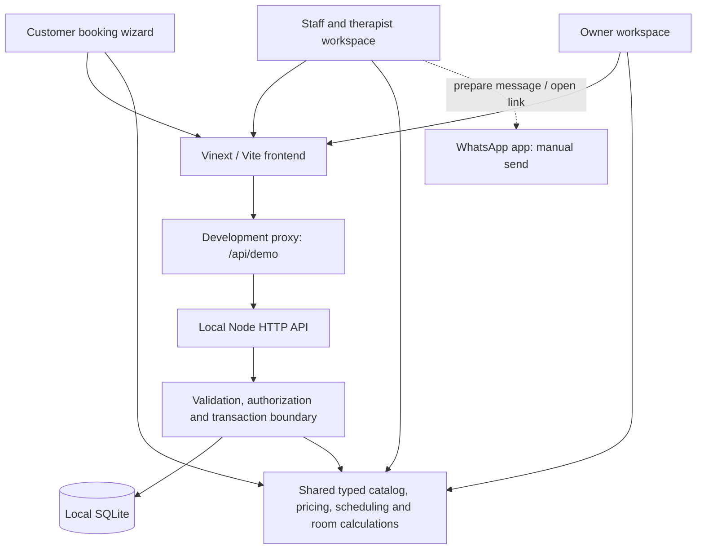
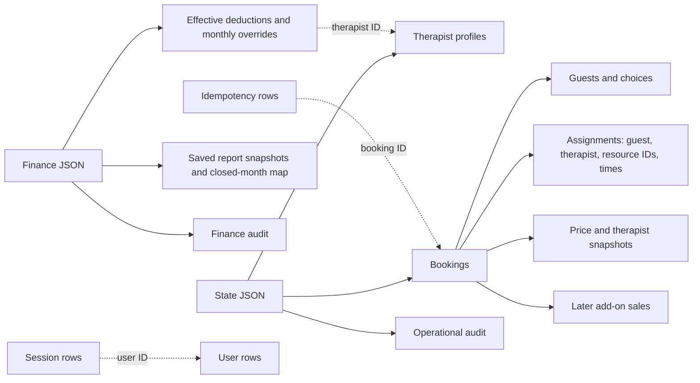
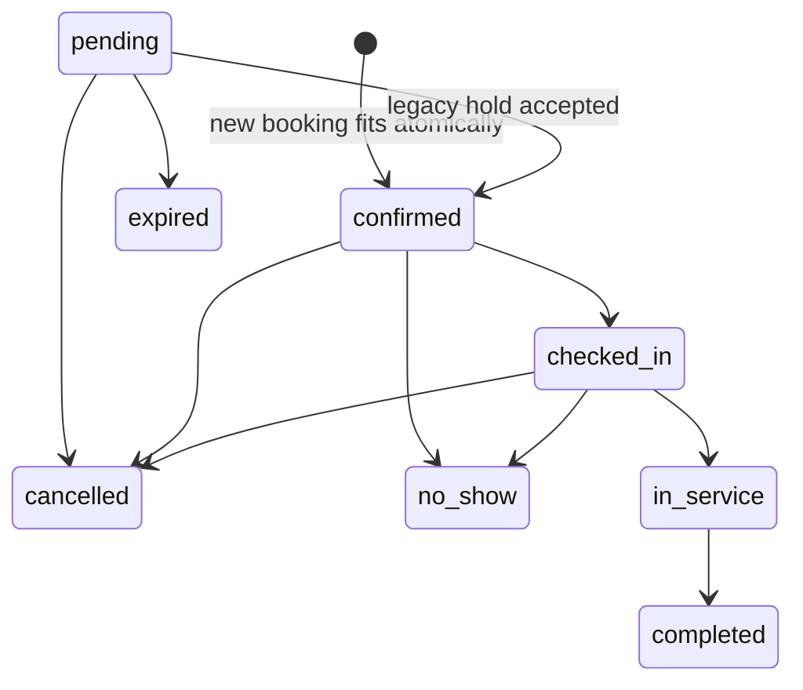
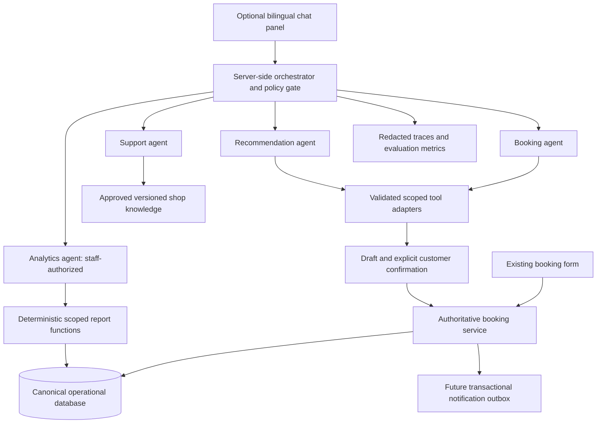

# Family Massage — Repository Audit and AI Extension Plan

Audit date: 19 September 2026. Source revision: `6207d022cc416aff3536d32149e9f522b79b8eed`.

## Executive summary

This repository implements a functioning **local booking and management demo**, not just a static menu. Customers can configure up to six guests, select therapist preferences, choose services and extras, see calculated availability, and reserve capacity. Staff can manage appointments, schedules, late add-ons, and room occupancy. Owners can inspect monthly sales, calculate a fixed 50% therapist commission, apply individual rental/electricity deductions, and freeze monthly statements.

The strongest reusable assets are the deterministic scheduling engine, transactional booking API, price snapshots, role checks, and financial calculations. These should remain authoritative when AI is added.

Important conclusions:

- **Current repository and hosted demo are different deployment surfaces.** This checkout uses a separate loopback Node server and local SQLite. It does not contain the hosted demo's Worker API or D1 persistence implementation. Do not infer deployed capabilities or security from this checkout alone.
- New bookings—including groups and specific-therapist bookings—confirm immediately if the entire allocation fits. Pending holds remain supported for legacy records, not as the normal creation path.
- “Live” means transactional reservation plus approximately 15-second interface polling, not WebSocket streaming or physical occupancy detection.
- Payments, prepaid-session balances, memberships, automated WhatsApp delivery, receptionist sales commission, multi-outlet management, and AI agents are **not implemented** here.
- **69 existing tests passed**, TypeScript passed, and lint failed with one navigation-rule error. Passing tests do not establish production readiness.
- Verified gaps include weak phone validation, overdue-treatment scheduling divergence, and receptionist access to historical booking amounts despite a today-only earnings screen.

Only this report was created. No application code, configuration, dependencies, database records, or deployment was changed. No credentials, configuration secret values, or actual customer records are reproduced.

## 1. Scope, evidence, and interpretation

### 1.1 What was examined

The inventory covered all 45 tracked project files: application routes, business logic, styles, tests, scripts, configuration, dependency manifests, documentation, and asset paths. Implementation findings come from source and executed checks, not README claims.

Evidence uses repository-relative paths and function names, with line numbers where useful. Line numbers refer to the revision above. They may change after later edits.

Excluded from content inspection: installed dependency internals, Git object history, generated build/cache output, local runtime databases, and private configuration files. Image assets were inventoried, not visually re-audited. This is a first-party implementation audit, not a dependency vulnerability audit, penetration test, or production database inspection.

### 1.2 Status vocabulary

| Status | Meaning in this report |
|---|---|
| Implemented | Working implementation exists for the stated narrow capability; does not imply production certification. |
| Partial | Some required behavior exists, but material elements are absent. |
| Demo-only | Functional behavior exists but uses the local demo runtime, sample identity/data, or operational assumptions. |
| Missing | No first-party implementation found for the requested capability. |

Data provenance is stated separately. A demo-only feature can persist newly entered test data; “demo” does not mean browser-only or fake responses.

### 1.3 Local versus published system

Verified in this repository:

- `.openai/hosting.json` points to the original Sites project and declares no D1 or R2 binding.
- `vite.config.ts` proxies `/api/demo` to a separate loopback API during development.
- `scripts/demo-server.ts:125` opens local SQLite through `node:sqlite`.
- There is no `app/api` route tree, `server/hosted-demo-core.ts`, `server/hosted-demo-store.ts`, `db/schema.ts`, or Drizzle migration directory in this checkout.

Prior publishing work in this conversation used a separate checkout for the online client demo with a hosted API and database. That is historical context, **not evidence that those files are present here**. This audit did not re-audit that external checkout or inspect the deployed database. Reconcile the two source trees before implementing production changes or an AI backend. Do not publish this local checkout blindly over the working online demo.

## 2. Project overview and architecture

### 2.1 Intended users and routes

| User | Entry point | Current purpose |
|---|---|---|
| Customer | `/`, `app/page.tsx` → `BookingWizard` | Bilingual five-step group booking and confirmation summary. |
| Receptionist/front desk | `/staff`, `StaffPage` | Appointment book, external bookings, operational updates, schedules, rooms, today's completed-service totals. |
| Therapist | `/staff`, restricted role | Own completed work and gross service value for today only. Not a full personal future schedule or payroll portal. |
| Owner | `/boss`, `BossPage`; also `/staff` | Monthly accounting, deductions, statement history/printing, room overview, and privileged staff operations. |

These are three routes within one application, not three independent applications or databases.

### 2.2 Technology inventory

| Layer | Verified implementation | Evidence |
|---|---|---|
| UI | React 19.2.6, Next.js 16.2.6 conventions, client components and App Router-shaped routes | `package.json`, `app/layout.tsx`, route files |
| Build/dev runtime | Vinext 1.0.0-beta.3 over Vite 8.0.13; scripts invoke Vinext rather than standard Next CLI | `package.json`, `vite.config.ts` |
| Language | TypeScript 5.9.3, strict checking; Node executes TypeScript tests/scripts | `tsconfig.json`, `package.json` |
| Styling | Global CSS plus CSS Modules; Tailwind 4.2.1 PostCSS plugin configured | `app/globals.css`, module styles, `vite.config.ts` |
| Local backend | Node HTTP server, explicit route dispatch, synchronous business transactions | `scripts/demo-server.ts` |
| Persistence | SQLite using Node's built-in `DatabaseSync`; WAL and busy timeout; JSON aggregate storage | `scripts/demo-server.ts:125–171` |
| Authentication | Application-owned local staff accounts; salted scrypt verification; hashed session-token lookup | `scripts/demo-server.ts`, `userFor`, auth route |
| Hosting scaffolding | Sites and Cloudflare Vite plugins, Wrangler tooling; no active persistent binding in local manifest | `vite.config.ts`, `.openai/hosting.json` |
| Testing | Node test runner, API integration fixtures, pure-function tests; ESLint 9 | six test files, `eslint.config.mjs` |
| Notifications | Generated text and manually opened WhatsApp links, not a messaging API | `app/order.ts`, `app/staff/page.tsx:59`, `BookingDetail` |
| Assets | Six sample portrait PNGs, social image, SVG icon | `public/therapists/`, `public/og.png`, `app/icon.svg` |

`next.config.ts` is empty configuration: **static export is not currently enabled**. A framework dependency does not imply that standard Next hosting or a standalone static deployment supports this backend.

### 2.3 High-level architecture — current checkout



`scripts/dev-demo.mjs` starts the API, waits for its public-state response, and then starts the frontend. `scripts/start-demo.command` is a macOS convenience launcher. Closing those processes stops this **local** system; GitHub is not its runtime host. The frontend's build alone does not deploy the separate Node API.

## 3. Existing feature inventory

### 3.1 Customer experience and catalog

| Feature | Actual behavior | Status / data | Implementation evidence |
|---|---|---|---|
| Five-step booking | Therapist → treatment → extras → date/time → contact/review. Explicit Back/Next; fixed frame, step focus management. | Implemented UI; demo-only reservation | `app/booking-wizard.tsx:14`, `next`, `confirm`; `app/booking.module.css` |
| English/Chinese | Language switch, localized catalog/profile text and inline UI strings; customer document language updated. | Implemented; hardcoded translations | `app/catalog.ts`, `BookingWizard`, `StaffPage`, `BossPage` |
| Therapist choice | Exclusive specific-person, gender, or no-preference paths; optional fallback changes required to preferred. | Demo-only; six sample profiles plus persisted edits | `app/booking-wizard.tsx:166`, `app/booking-flow.ts`, `sampleTherapists` |
| Compatibility | Filters treatment choices based on therapist category/add-on capabilities; changing incompatible preferences clears treatment. | Implemented rules; sample skill configuration | `matchingTherapists`, `changeTherapistChoice`, `isTherapistCompatible` |
| Catalog | Four categories; 14 duration-based treatments; 20 single-visit bundles; category-specific extras. | Implemented; hardcoded menu data | `app/catalog.ts:167` |
| Treatment versus package | Mutually exclusive paths rather than two simultaneous charges. Changing kind/category resets affected choices. | Implemented | `BookingWizard`, step 1 |
| Extras | Visible price/time cards; incompatible extras disabled; package-included extras cannot be charged again. | Implemented rules; hardcoded prices/durations | wizard step 2; `getIncludedAddonIds`; `validateInput` |
| Prices | RM totals calculated from catalog IDs; server ignores caller-supplied monetary totals; records price snapshots. | Implemented; catalog prices and stored snapshots | `guestTotal`, `orderTotal`, `priceSnapshots`, `createBooking` |
| Time picker | Weekly date strip and time buttons; full-duration availability and one-hour customer notice. | Demo-only live state, deterministic calculation | wizard step 3; `calculateDemoAvailability` |
| Validation/recovery | Inline contact errors and focus; prevents submit without capacity; conflict keeps form data and asks customer to choose again. | Implemented, with phone validation defect below | `getBookingValidationIssues`, wizard `confirm` |
| Confirmation receipt | Assigned therapist, per-guest times/prices, total, contact and copyable text; receipt updates every 15 seconds while page remains open. | Demo-only stored booking; not payment receipt | wizard receipt branch; `readDemoBooking` |
| WhatsApp customer handoff | Share button removed from current wizard. Shop contact text and copy-summary remain. | Implemented removal; legacy helper remains | `app/booking-wizard.tsx:154–156`, `buildWhatsAppUrl` |
| Durable customer draft/account | Wizard state is component memory; no customer login, account history, or recovery link UI found. | Missing | wizard state; route and schema inventory |
| Responsive/accessibility support | Responsive layouts, labeled inputs, focus styling, dialog semantics, reduced-motion rules and error announcements. | Partial verification: source support, no browser conformance testing | CSS modules; `Dialog`; wizard field markup |

The catalog is source-configured, not editable through an owner menu-management screen. Most current UI translations are inline; the large `ui` dictionary in `app/catalog.ts:296` also contains older interface copy and is not proof that those older controls are active.

Current base prices (RM), as code—not a new approval of shop pricing:

| Category | 30 min | 60 min | 90 min | 120 min |
|---|---:|---:|---:|---:|
| Aromatherapy | — | 85 | 125 | 150 |
| Thai | — | 80 | 100 | 140 |
| Full body | 45 | 68 | 100 | 130 |
| Foot | 38 | 50 | 75 | 98 |

**Price verification caveat:** the earlier Thai menu image supplied in this conversation appears to show RM 110 for 90 minutes, whereas `app/catalog.ts:206` and `app/order.test.ts:29` both use RM 100. Treat this as a shop-confirmation item, not a silently corrected price. The test named “matches every price shown…” compares two code lists; it does not independently read or verify the source image. No code was changed.

### 3.2 Scheduling, groups and rooms

| Feature | Actual behavior | Status / data | Evidence |
|---|---|---|---|
| Availability engine | Checks skills, preference, leave, shift, opening/closing, therapist overlap, resource overlap and total capacity. | Demo-only, functional | `app/demo-booking.ts:512`, `findDemoSchedule` |
| Full duration | Item duration plus extras plus five-minute cleaning; package durations include the bundled components. | Implemented; configured estimates | `app/catalog.ts:68`, `estimatedGuestDuration` |
| Group booking | One to six guests, each with selections/preferences; all assignments succeed together or none are saved. | Demo-only, functional | `validateInput`, `findDemoSchedule`, `createBooking` |
| Flexible starts | Searches offsets from zero to 30 minutes in five-minute increments, preferring closer finishing times. | Partial: no guarantee of identical finishing time | `offsetChoices`, `findDemoSchedule` |
| Automatic confirmation | All successfully allocated new bookings use `confirmed`, including groups/specific therapists. | Demo-only, functional | `scripts/demo-server.ts:264`, `createBooking` |
| Double-booking protection | Server rechecks within SQLite write transaction; idempotency avoids duplicate creation. | Implemented for this runtime; not distributed proof | `transaction`, `createBooking`; API race tests |
| Legacy pending holds | Expiration releases old pending allocations; cleanup runs every 15 seconds and before transactions. | Implemented compatibility behavior | `expirePending`, server timer; normal creation does not create holds |
| Shifts and leave | One repeating daily shift and explicit leave dates per therapist; incompatible edits rejected against existing bookings. | Partial workforce management; editable demo records | `TherapistProfile`, `updateTherapist`, `ProfileForm` |
| Rooms/chairs | Six separate one-bed rooms and six foot chairs; resources generated from constants. | Demo-only; fixed physical model | `shopResources`, `requiredResourceTypes` |
| Room cards/timeline | Per-day bookings/customers, free rooms/chairs, available staff, session and cleaning times, next visit. | Demo-only; derived from bookings | `roomSchedule`, `RoomBoard`, `BossRooms` |
| Actual room management | No room CRUD, maintenance blocks, cleaning acknowledgement or physical sensor integration. | Missing beyond derived occupancy | resource constants and endpoint inventory |
| Overrun warning | Live room view flags an in-service treatment beyond scheduled end. | Partial: warning does not extend reservation | `app/room-schedule.ts:28–43`, `blockingAssignments` |

Mixed body/foot packages reserve **both a bed and a chair for the whole visit**, not successive resource phases. This is conservative and may reduce usable capacity. A group is counted as guests for overall capacity, not once per bed/chair. The overall maximum remains six customers, not twelve.

### 3.3 Staff, owner, finance and communications

| Feature | Actual behavior | Status / data | Evidence |
|---|---|---|---|
| Appointment book | Date/status/source filters; search by booking contact/reference; detail dialogs and therapist timeline. | Demo-only; persisted test bookings | `app/staff/page.tsx`, `StaffPage` |
| External booking entry | Front desk/owner can record phone, WhatsApp and walk-in bookings; staff uses five-minute choices and may bypass customer lead time. | Demo-only; manual entry, not external-channel ingestion | `CreateBooking`, `reserveStaffDemoBooking`, `validateInput` |
| Visit lifecycle | Confirm legacy hold, check in, start, complete, cancel, no-show; constrained transitions. | Demo-only; booking-level status | `TRANSITIONS`, `updateBooking`, `BookingDetail` |
| Reschedule/reassign | Capacity checked again; unsuccessful reschedule preserves original allocation; required preferences enforced. | Demo-only, functional | `updateBooking`, `rescheduleDemoBooking`, `reassignDemoBooking` |
| Late add-on sales | Records source/time/actor, locks existing prices, extends same therapist/resources when time fits; prevents duplicates. | Demo-only, functional | `GuestExtrasForm`; `updateBooking` action `add_addons`; `extendDemoAssignment` |
| Profile management | Owner edits existing profile number, bilingual details, gender, skills, active status and sample portrait. Receptionist edits shifts/leave only. | Partial; no account/profile creation workflow or protected portrait storage | `ProfileForm`, `updateTherapist` |
| Today's earnings | Completed guest treatments only; gross value, count, per-therapist rows. Therapist role gets only own rows. | Demo-only; actual calculation over test records | `calculateDemoDailyEarnings`, `/staff/today-earnings`, `TodayEarnings` |
| Monthly owner accounts | Completed-service sales by therapist/day, booked versus later extras, 50% commission, shop share and final balance. | Demo-only; sample initial deductions, persisted edits | `scripts/boss-finance.ts:106`, `BossPage` |
| Per-therapist deductions | Rental/electricity per month, optional effective defaults for future months; integer sen internally. | Implemented within demo accounting | `saveDeductions`, `BossFinanceState`, `DeductionsEditor` |
| Month-end statements | Past months can be frozen, printed, reopened with reason; earlier snapshots retained; optimistic revision guards edits. | Implemented reporting, not payment or statutory payroll | `saveStatement`, `reopenMonth`, boss print CSS |
| Audit history | Booking/profile actions and owner finance changes recorded separately. | Partial audit trail; mutable local storage, no external tamper protection | `audit`, `financeAudit`, finance JSON |
| Receptionist commission | Late-sale record identifies who entered it and where; commission still follows serving therapist at fixed 50%. | Missing separate seller/receptionist commission | `DemoAddOnSale`, `snapshotTherapists`, `calculateBossMonth` |
| WhatsApp replies | Staff prepares status/reminder/alternative text, copies it or opens WhatsApp; staff must send. | Partial notifications; no automation | `bookingMessage`, `BookingDetail` |
| Customer management | Contact/notes stored per booking, searchable operationally. No distinct customer entity/history/consent portal. | Partial | `DemoBooking`, staff filters, schema |
| POS/payments | Totals and service records exist; no payment method, payment transaction, settlement, refund or cash reconciliation. | Missing payment/POS workflow | `DemoBooking`, API inventory |
| Prepaid packages | Catalog packages combine treatments for one visit. No purchase balance or session redemption ledger. | Missing prepaid-session tracking | `MenuItem.kind`, schema |
| Loyalty/membership/inventory | No points, tiers, stock ledger, SKU management or membership entity. | Missing | first-party source/schema inventory |
| Multi-outlet | Single business configuration; no outlet ID, outlet scoping or branch permissions. | Missing | catalog, booking/profile types, schema |

Gross completed-service value is **not proven cash received**. Staff's daily total is not take-home commission. Owner shop share is before shop expenses, not net profit. Closing or printing a statement never transfers money.

## 4. Backend and database

### 4.1 Persistence model

Schema is created inline in `scripts/demo-server.ts:129,134`; no versioned migrations or ORM schema are present.

| Table | Shape and key | Purpose / relationships |
|---|---|---|
| `state` | Singleton `id = 1`, JSON document | `DemoState`: version, seed date, therapist array, booking array, operational audit array. |
| `boss_finance` | Singleton `id = 1`, JSON document | Settings, monthly overrides, saved statements, closed-month map, owner-only finance audit. Separate from staff/public state. |
| `users` | Text ID primary key, unique email, display name, role, authentication verifier material | Seeded owner, receptionist and six therapist accounts. Actual credential material omitted. |
| `sessions` | Hashed-token primary key, user ID, expiration | Application joins to `users`; eight-hour session lifetime. Actual session values omitted. |
| `idempotency` | Request-key primary key, fingerprint, booking ID | Associates an actor-scoped request with its created booking. Booking target is inside JSON, not a relational booking table. |

There are **no separate SQL tables** for appointments, guests, therapists, resources, customers, add-on sales, payments, packages or outlets. IDs inside JSON are logical relationships, not database-enforced foreign keys. `sessions.user_id` also has no declared foreign-key constraint in this schema.

Logical model:



This design keeps demo implementation compact, but each state transaction parses and rewrites the entire JSON document. Even public-state reads use the transaction helper and write the aggregate back. This creates unnecessary write contention, unbounded payload growth and limited queryability as usage increases.

### 4.2 Important types and request shapes

Defined in `app/catalog.ts:33–49`, `app/demo-booking.ts:16–159`, and `app/boss-types.ts`:

```typescript
type TherapistChoice = {
  mode: 'none' | 'gender' | 'specific';
  requirement: 'preferred' | 'required';
  gender: 'female' | 'male' | '';
  therapistId: string;
};

type GuestSelection = {
  id: string; name: string;
  categoryId: string; itemId: string; addOnIds: string[];
  therapistPreference: string;
  therapistChoice?: TherapistChoice;
};

type ReservationInput = {
  date: string; time: string; // YYYY-MM-DD and HH:mm, Malaysia time
  groupTiming: 'together' | 'flexible';
  contactName: string; contactPhone: string; notes: string;
  guests: GuestSelection[];
  source?: 'online' | 'phone' | 'whatsapp' | 'walk_in';
  idempotencyKey?: string;
};

type ReservationResult =
  | { ok: true; booking: DemoBooking }
  | { ok: false; reason: 'conflict'; alternatives: string[] };
```

Although the TypeScript input marks `idempotencyKey` optional, the server requires it; client reservation wrappers generate one if missing. Public callers cannot choose a privileged source: validation forces `online`.

`DemoBooking` includes IDs/reference, source/date/time, contact/notes, guests, assignments, total, lifecycle status, creation/hold timestamps, receipt access token, snapshots, and optional later sales. An assignment identifies guest, therapist, start, end, cleanup end and resource IDs. Tokens are access secrets and should never enter AI prompts or logs.

Boss responses use integer **sen**, while catalog/booking/daily-earnings values use **RM numbers**. Never mix them in an integration. `BossMonthReport` includes month/status/revision, therapist/day/line breakdowns, totals, available months, statement history and finance audit.

### 4.3 Endpoint inventory

Base prefix: `/api/demo`. Dispatch lives in `scripts/demo-server.ts:419–510`; browser wrappers in `app/demo-booking.ts:723–751` and `app/boss-api.ts`.

| Method and path | Request | Response | Authorization |
|---|---|---|---|
| `GET /public-state` | None | Version, seed date, profiles, redacted occupancy rows | Public |
| `GET /session` | Session cookie if present | `{ user: DemoStaffUser \| null }` | Public session lookup |
| `POST /auth` | Email and password fields; values intentionally omitted | `{ user }`, session cookie | Credential verification; local login throttle |
| `DELETE /auth` | Cookie if present | `{ ok: true }`, cleared cookie | Logs out current session |
| `POST /bookings` | ReservationInput with request key | 201 success or 409 scheduling conflict | Public; server validates input |
| `GET /bookings/:id?token=…` | Receipt token, value omitted | Customer-projected `DemoBooking`; 404 on invalid token | Capability-token access |
| `GET /staff/state` | Cookie | Full operational `DemoState` | Owner/receptionist only |
| `GET /staff/today-earnings` | Cookie; no caller-controlled date | `DemoDailyEarnings` | Owner/receptionist: all; therapist: own |
| `POST /staff/bookings` | ReservationInput with source/key | 201 success or 409 conflict | Owner/receptionist |
| `PATCH /staff/bookings/:id` | One action body below | `{ ok: true, booking }` or conflict | Owner/receptionist |
| `PATCH /staff/therapists/:id` | Therapist profile | `{ profile }` | Owner; receptionist limited to shift/leave edits |
| `POST /staff/reset` | Empty body | Fresh sample `DemoState` | Owner only; leaves financial records/settings intact |
| `GET /boss/month?month=YYYY-MM&statementId=…` | Optional month and historical statement ID | `BossMonthReport` | Owner only |
| `PATCH /boss/month/:month/therapists/:id` | `{ rental, electricity, applyToFutureMonths, expectedRevision }` | Updated report | Owner only; amounts in RM input |
| `POST /boss/month/:month/close` | `{ expectedRevision }` | Frozen report | Owner only; past months |
| `POST /boss/month/:month/reopen` | `{ expectedRevision, reason }` | Reopened report, historical snapshot retained | Owner only |

Booking PATCH bodies:

```typescript
{ action: 'status', status }
{ action: 'reschedule', date, time, groupTiming }
{ action: 'reassign', guestId, therapistId }
{ action: 'add_addons', guestId, addOnIds, source: 'counter' | 'during_service' }
```

Normal errors return `{ error: string }`. Codes include 400 validation, 401 authentication, 403 role/origin denial, 404 missing record, 409 conflict/stale revision, 413 oversized body, 429 login throttle and 500 unexpected failure. Scheduling conflicts have the structured `reason`/`alternatives` body; not every 409 does.

Mutations require the custom client header and, when an Origin is supplied, a loopback hostname. This is a local-demo defense, not production origin configuration. The custom header is not an authentication credential. There is no standalone availability HTTP endpoint: the browser receives occupancy and runs `calculateDemoAvailability`; submission is independently revalidated on the server.

### 4.4 Booking lifecycle, end to end

1. `BookingWizard.refresh` loads public profiles/occupancy. Sample profiles are an initial browsing fallback, but submission requires a successful connection.
2. Customer choices form a draft in React memory. `matchingTherapists`, `getMenuItem`, `guestTotal` and duration helpers drive the UI.
3. `calculateDemoAvailability` enumerates 30-minute starts and invokes `findDemoSchedule` for the complete group, applying the one-hour lead rule.
4. Customer reviews and explicitly confirms. `confirm` uses a submit lock and retained request key, then calls `reserveDemoBooking`.
5. `createBooking` enters `transaction`, acquires the SQLite write transaction, loads current state and expires old holds.
6. The server checks actor-scoped idempotency and input fingerprint. An exact retry returns the existing booking; key reuse with changed content fails.
7. `validateInput` verifies date/time, minimum notice, one-to-six unique guest IDs, catalog IDs, unique/category-compatible extras, preference structure, selected-therapist compatibility and contact fields.
8. `findDemoSchedule` runs on current persisted state. Failure returns nearest same-date alternatives; nothing is partially booked.
9. Success assigns every guest, calculates trusted prices, snapshots terms/therapists, generates reference and receipt access, sets `confirmed`, appends audit/idempotency records, and commits.
10. The receipt renders the stored result. Staff/customer views refresh through polling. Staff subsequently manages visit status and permitted extras.

States:



Statuses apply to the entire booking, not independently to each guest. Terminal records cannot be reopened through the operational API. The displayed 15-minute lateness policy is not an automatic no-show/cancellation job.

### 4.5 Scheduling algorithm and concurrency guarantees

`findDemoSchedule` sorts constrained guests first, checks therapist-set feasibility, then searches assignments across compatible therapists and allowed start offsets. Each assignment reserves the complete treatment plus cleaning. Search is bounded at 12,000 steps. A search-limit failure can therefore mean “not found within the bound,” not a mathematical proof that no schedule exists.

`BEGIN IMMEDIATE` occurs **before** loading and allocating current state. Booking, assignments, audit and idempotency insert commit together. SQLite allows one simultaneous writer; an immediate transaction requests that write transaction at the start. See [SQLite transaction documentation](https://www.sqlite.org/lang_transaction.html). This is the basis for the implementation's race protection—not disabled buttons or a previously shown green time slot.

Tests in `scripts/demo-server.test.ts:80,144,481` exercise final-capacity submissions, competing full groups, and a late extension racing a new booking. They use concurrent HTTP requests against a local fixture. They do not prove multi-region or distributed-worker correctness, sustained load behavior, or separate-database coordination.

Other limitations:

- The local synchronous server serializes significant work; the whole-document transaction is unsuitable as evidence of horizontal scalability.
- Busy timeout exists, but lock-contention errors have no specialized retry/backoff response.
- There is no SQL exclusion/unique allocation constraint for resource/time overlap; correctness relies on this transaction path and scheduler. Direct writes could bypass it.
- Availability is advisory until commit. No capacity is held while a customer merely browses.
- Alternatives are nearby valid starts on the selected date, not a cross-date search.
- Public-state reads disclose operational occupancy, though contact fields are removed. A future server-side availability endpoint can return fewer details.

### 4.6 Accounting behavior

`calculateBossMonth` in `scripts/boss-finance.ts:106` uses completed bookings whose **appointment date** lies in the month. It does not use payment date or a stored actual completion timestamp.

Per therapist:

```text
Gross sales = base treatment/package + booked extras + later extras
Commission = round(gross sales in sen / 2)
Shop share = gross sales − commission
Final therapist balance = commission − rental − electricity
```

Rounding occurs once per therapist/month. Later extras already appear in price snapshots; `saleLine` classifies them rather than adding them twice. Included package components stay within the package price. Historical therapist snapshots preserve attribution if a profile is absent.

Rental/electricity defaults are effective-dated; a monthly override takes precedence. Closed statements retain their original report snapshot. Reopening changes the closed mapping, not the old saved report. Revision fingerprints prevent saving against stale figures. Negative balances are shown, not automatically carried forward as debt.

No receptionist seller identity/rate ledger exists. `recordedBy` identifies entry, not entitlement. Before adding seller rewards, the owner must define whether they come out of the shop share, therapist share, or are additional expense; when they are earned; and how refunds affect them.

## 5. Existing AI functionality

### 5.1 Search findings

First-party source and dependency declarations were searched for AI/LLM/chatbot/RAG/embedding/vector/agent frameworks and browser model-tool hooks. No application model inference, prompt templates, chat route, retrieval index, embedding pipeline, agent runtime, conversation store, or AI evaluation suite was found.

The `@openai/sites-vite-plugin` dependency and `.openai/hosting.json` are hosting integration, **not evidence of an AI feature**. HTTP-agent or similar transitive dependency names are also not autonomous-agent implementations.

There is no current chat interface. WhatsApp text is constructed deterministically, not generated by an LLM. The earlier hosted checkout's tool registration must not be attributed to this checkout; no WebMCP registration is present here.

### 5.2 Useful integration foundations

- Typed catalog and localized text: suitable grounding data.
- Deterministic scheduling/pricing functions: reusable tools, not logic to rewrite in prompts.
- Authoritative reservation boundary: suitable mutation target after authentication hardening.
- Role-gated daily/monthly reports: suitable read-only analytics inputs.
- Structured errors, conflict alternatives, idempotency and price snapshots: useful for reliable conversational workflows.

Missing infrastructure includes a server-side model adapter, validated tool schemas, conversation state, authorization-scoped tool execution, consent/redaction, traces, evaluation datasets and a kill switch. None is added by this audit.

## 6. TunaiPro-inspired gap analysis

The [TunaiPro public website](https://tunaipos.com/) was consulted on the audit date. It markets appointment management, WhatsApp automation, commission calculations, package tracking, customer records and multi-outlet capabilities. This is vendor marketing, not a verified technical specification or an assessment of its internal implementation. The requirements below are the user's comparison criteria. No assumption is made that TunaiPro exposes an integration API usable by this application.

| Capability | This repository | Gap | Business priority |
|---|---|---|---|
| Online appointment management | **Demo-only**, substantial booking/availability/lifecycle logic | Production backend alignment, real staff configuration, operational exception handling | Essential first |
| Customer profiles/history | **Partial**, per-booking contacts/notes and staff search | Stable customer identity, verified access, longitudinal history, consent and restricted notes | High after booking stability |
| Prepaid packages/memberships | **Missing**; one-visit bundles are implemented | Purchase/redemption ledger, expiry, balances, refunds, membership rules | Only if the shop sells these |
| POS/payment management | **Partial** sales calculation; payment handling **missing** | Tender recording, checkout, reconciliation, refunds, receipts; optional gateway later | High for accurate earnings |
| Automated WhatsApp | **Partial** manual templates; automatic delivery **missing** | Approved provider integration, scheduling/outbox, delivery state, retries, consent | High once production bookings are reliable |
| Staff scheduling/commission | **Demo-only**, recurring shifts, leave, fixed 50%, deductions | Breaks/date-specific shifts, seller commission, payroll/payment ledger, configurable rules | High; avoid unnecessary tiers initially |
| Analytics/reporting | **Partial**, operational metrics and monthly statements | Payment-aware reporting, utilization, trends, exports, no-show and demand analysis | Medium/high |
| AI customer support | **Missing** | Grounded knowledge, chat, escalation, evaluations, secure tools | Good first AI slice |
| Multi-outlet | **Missing** | Outlet-scoped resources, users, records, prices and reports | Defer unless multiple outlets exist |

Do not replicate every competitor feature immediately. For this six-therapist shop, reliable bookings, room/staff exception handling, actual checkout records, seller attribution, and reminders have more immediate value than multi-outlet or elaborate membership tiers.

WhatsApp API documentation could not be retrieved successfully during this audit due to a rate-limited response. Provider-specific eligibility, pricing, templates, messaging-window and consent requirements must be verified against current official documentation before implementation; no current pricing or policy claim is asserted here.

## 7. Verified gaps and production risks

| Priority | Finding and evidence | Consequence / recommended direction |
|---|---|---|
| Critical before public use of this checkout | Local demo accounts have a shared seeded credential and login hints in source/UI (`createDemoServer`; staff/boss login branches). Values intentionally omitted. | Do not expose this backend as production. Provision individual real accounts and remove demo access paths; separately audit hosted auth. |
| High | Source/deployment mismatch: local proxy, no deployed API route, null persistence bindings. | Select one canonical source and supported backend before feature work; preserve hosted data through explicit migration. |
| High | Overdue `in_service` records are flagged by `roomSchedule` but scheduler uses stored `cleanupEnd` (`blockingAssignments`). | A therapist still working can become bookable after planned end. Add a deliberate overrun/blocking policy and staff reconciliation workflow. |
| High | `/staff/state` gives receptionists all historical bookings and their totals, even though `/staff/today-earnings` is today-only. | “No past earnings” is not a complete data-access boundary. If strictly required, return role-scoped historical projections without amounts, not just hide UI. |
| High | No actual payment ledger; completing a booking drives earnings. | Sales/commission may be mistaken for collected money. Introduce payment status and reconciliation before financial production use. |
| High | `isValidBookingPhone` (`app/order.ts:83`) validates allowed characters/length, not a minimum digit count. | Separator-only input is accepted. Normalize digits/country code and validate consistently with messaging needs. |
| High | No public-booking abuse throttle, verified customer contact, or durable anonymous identity. Login throttle is process-memory only. | Public deployment needs anti-abuse limits and appropriate contact verification; a phone number alone must not authorize viewing history. |
| Medium | Receipt capability returned to the customer is held in memory; no recovery UI; query-token lookup has no expiry/rotation policy. | Reload can lose access; URLs/logs can leak access. Design safe recovery and redact capability tokens. |
| Medium | Operational source records are JSON aggregates and reads acquire a write transaction. | Growing latency/contention and difficult migrations. Add schema/version strategy and normalized queryable records when productionizing. |
| Medium | Entire group shares one lifecycle status; actual start/end/completion timestamps are not first-class fields. | Cannot accurately complete one guest independently, measure actual utilization, or reconcile different finish times. |
| Medium | Fixed shift plus leave only; no breaks, date-specific shifts, room maintenance or independent resource blocks. | Availability can overstate real operational capacity unless staff manages exceptions outside the system. |
| Medium | Flexible-start UI implies finishing together; algorithm only prefers it within 30-minute offsets. | Show actual per-guest schedule and avoid a guarantee the allocator cannot ensure. |
| Medium | Customer copy-summary uses current catalog through `buildOrderMessage`; visual receipt uses stored snapshots. | Historical copied totals/text could diverge after menu changes. Use the same snapshot formatter for both. |
| Medium | Receptionist add-on rewards absent; `recordedBy` is not salesperson/commission attribution. | Clarify rules before payroll; do not assume the requested reward exists. |
| Medium | Hardcoded 90-minute Thai price conflicts with earlier supplied image; test repeats code value. | Confirm approved price and update both catalog and independent acceptance fixture in later work. |
| Medium | Automatic 15-minute late cancellation is policy text only. | Staff still marks no-shows manually; specify exceptions and safeguards before automating release. |
| Low/maintenance | README describes four steps; wizard has five. Old translation/CSS and estimated-busy-time helper remain. | Keep docs synchronized and distinguish legacy helpers from active allocation. |
| Low/maintenance | Lint error at `app/booking-wizard.tsx:118`; metadata origin is localhost in `app/layout.tsx`. | Resolve navigation strategy deliberately and set correct metadata when aligning deployment. |

Additional boundaries: no backup/restore procedure, customer retention/deletion workflow, production monitoring, account recovery, MFA or resource-level database constraints were found. Sample portraits are public assets; inline image data is accepted by the profile API, but there is no protected object-storage upload flow. Staff profile UI only selects existing sample images.

The code's local cookie omits the Secure attribute, appropriate to its current HTTP-local assumption but not a production configuration. Origin checks validate loopback hostnames rather than an exact production origin. These observations must not be generalized to the separately hosted backend.

### 7.1 Small read-only reproductions

Two additional pure-function probes used constructed sample state, not the persisted database:

- `isValidBookingPhone('--------')` returned `true`.
- A sample therapist still marked `in_service` after a planned 16:05 cleanup was accepted by `findDemoSchedule` for a later 17:30 appointment. This confirms the reservation-window behavior, not an actual shop conflict.

These probes explain why a passing regression suite does not cover every operational risk.

## 8. Proposed multi-agent AI integration

Everything in this section is a **recommendation**, not current functionality. Start with one server-side orchestrator and separately defined agent/tool responsibilities. Four independent autonomous processes are not necessary to demonstrate multi-agent engineering.

### 8.1 Integration architecture



Keep the normal form fully functional with AI disabled or unavailable. Both interfaces must reach the same validation, scheduler, price calculation and transaction path. Never let an agent directly append a booking to JSON or generate arbitrary database writes.

### 8.2 Agent responsibilities and reuse

| Agent | Responsibilities and data | Existing reusable code/API | New components required |
|---|---|---|---|
| Booking Agent | Extract guest count, service IDs, dates, times and preferences; ask for missing details; offer valid alternatives; prepare draft. Needs catalog, current scheduling constraints and scoped availability. | `getMenuItem`, `estimatedGuestDuration`, `calculateDemoAvailability`, `findDemoSchedule`, `nearestAvailableTimes`; authoritative booking POST and idempotency behavior | Validated conversation draft, server-side availability adapter, explicit confirmation artifact, request ownership, safe retry/recovery. |
| Customer Support Agent | Answer approved hours, services, process, pricing and policy questions; escalate uncertain or sensitive questions. | `business`, `bookingSettings`, localized catalog; authenticated receipt lookup only when properly authorized | Versioned FAQ/policy documents, retrieval with citations, escalation queue, consent-aware conversation retention. |
| Service Recommendation Agent | Translate non-medical preferences such as duration, budget and therapist preference into a small compatible shortlist. | `catalog`, `matchingTherapists`, `isTherapistCompatible`, `getRequiredCategoryIds`, `getRequiredAddOnIds`, `guestTotal` | Structured preference schema, deterministic filters/ranker, explanation layer, acceptance feedback. No purchase-history personalization until that data legitimately exists. |
| Analytics Agent | Explain approved totals, answer scoped operational questions, describe trends from deterministic aggregates. | `calculateDemoDailyEarnings`, owner `GET /boss/month`, `calculateBossMonth`, room-derived metrics | Role-scoped aggregate endpoints, metric definitions, historical data pipeline, report provenance and read-only tool permissions. |
| Orchestrator | Route intent, preserve authenticated role/locale/draft state, limit tools and budget, request confirmation, handle errors and handoff. | Existing role checks, typed result union, mutation boundaries and errors | Server-side model adapter, schema validation, tool allowlists, bounded workflow state machine, trace IDs, timeouts, retries and feature flag. |

`validateInput`, `createBooking` and `transaction` currently live inside the local server module/closure. They are **not ready-made exported agent tools**. Reuse the existing HTTP boundary first or deliberately extract a shared service layer later, with regression tests. Browser wrappers use relative URLs and browser cookies; a server-side agent needs an explicit authenticated adapter, not a blind import of those wrappers.

Do not use `estimateTimeSlotAvailability` from `app/order.ts:148` for AI bookings: it uses the old estimated busy-staff map. Use the actual profile/occupancy scheduler. Do not treat `findDemoSchedule` alone as a reservation: it does not persist, authenticate callers, or by itself enforce every public-input rule.

### 8.3 Proposed tool contracts

These are proposed contracts, not existing routes:

| Tool | Permission | Output/guardrail |
|---|---|---|
| `listServices(locale)` | Public read | Stable catalog IDs, approved labels, price and duration; no customer data. |
| `searchAvailability(draft)` | Public scoped read | Valid same-date slots and assignment preview with freshness marker; no full shop booking list. |
| `prepareBooking(draft)` | Customer draft | Server-calculated summary; no capacity promise and no mutation. |
| `confirmBooking(draftId, confirmationId, requestKey)` | Explicit customer approval | Calls authoritative transaction; returns saved booking or conflict requiring reselection. |
| `readMyBooking(accessContext)` | Verified booking access | Minimal own-booking projection; never search by phone alone. |
| `getTodayPerformance()` | Staff role-scoped | Therapist gets only own today; receptionist gets approved today aggregate. |
| `getMonthlySummary(month)` | Owner only | Aggregates by default; no unnecessary contact data or private notes. |
| `handoffToStaff(reason)` | Scoped support action | Creates a review task only; does not silently change a reservation. |

A confirmation should bind to the exact reviewed guest selections, preference strength, date/time and server-calculated price. Any changed draft invalidates the old confirmation. Reading availability must never implicitly confirm a booking.

### 8.4 What should and should not use an LLM

| Appropriate LLM role | Deterministic application responsibility |
|---|---|
| Understand English/Chinese requests and extract candidate fields | Validate dates, catalog IDs, phone, role and payload shape |
| Ask concise clarifying questions | Calculate prices, duration, commission and deductions |
| Explain a returned conflict and available alternatives | Check overlap, leave, resource capacity and commit reservations |
| Retrieve/explain approved policy with citations | Authenticate, authorize and scope every database read/write |
| Explain a compatible recommendation | Enforce budget, skills, required therapist/gender and opening hours |
| Summarize numeric report results | Compute metrics, reconcile financial records and freeze statements |

No AI is needed for routine reminders, receipt formatting, payroll arithmetic or appointment conflict prevention. An LLM must not decide that a medical condition is safe for a treatment, promise therapeutic results, override contraindication review, invent prices or guarantee capacity.

### 8.5 Authentication, privacy and safety

1. Execute model calls on the server; expose no provider credentials to browser code. Do not grant the model direct database or hosting access.
2. Derive user role and resource scope from authenticated server context, never a prompt-provided role or therapist ID. Recheck authorization for every tool call.
3. Customer support has no access to owner finance. Therapist analytics stays own-today only. Do not route an anonymous “how much did the shop earn?” request into the owner tool.
4. Keep contact details in the application layer where possible. Send the model only fields needed for the task. Exclude session/receipt secrets, payroll deductions and unrelated customer notes.
5. Treat user messages, notes and retrieved documents as untrusted content. They cannot alter permissions, tool allowlists or confirmation rules. Test prompt-injection attempts explicitly.
6. Use approved, versioned shop policies. Start with structured lookup or a small curated knowledge set; embeddings/vector storage are optional, not mandatory for a small catalog.
7. Obtain appropriate consent and define retention before storing conversations or sensitive treatment notes. Redact traces; do not use real customer data for portfolio demonstrations.
8. Show a structured review and require an explicit customer action before reservation. This is customer authorization, **not a return to mandatory staff approval** for normal available bookings.
9. Staff approval remains appropriate for undefined policies, exceptional discounts/refunds, uncertain treatment suitability, overrides and financial corrections.

### 8.6 Concurrency and failure handling

- Availability can become stale during a conversation. Commit through the same atomic booking service as the form.
- On 409 scheduling conflict, retain the draft, refresh alternatives, and ask the customer to choose and confirm again. Never silently choose another time or weaken a required preference.
- Retry the identical confirmed request with the same idempotency key after a timeout. Do not create a fresh request key simply because the response was lost.
- Differentiate “not reserved,” “saved but response uncertain,” and “confirmed.” Only claim success from the authoritative record/response.
- Add a safe request-status lookup for recovery if production requirements demand it; do not let an LLM infer success from a timeout.
- A model/retrieval outage should leave the form and deterministic help available. A database outage must fail closed for reservations.
- Future automatic notifications should use an outbox committed with the booking, a deduplicated worker, delivery state and retry limits. A failed WhatsApp message must not delete a valid booking.
- Analytics should include report period, timezone and freshness. Use read-only aggregate tools, not unrestricted natural-language-to-SQL against customer records.

## 9. Development roadmap and measurable evaluation

All phases are proposed. No implementation is authorized by this report alone.

### Phase 0 — Align and stabilize the actual product

Choose the canonical local/hosted source; document deployment and persistence. Confirm real therapist skills, shifts and menu prices. Fix validation and access-boundary issues; decide overrun, staggered group and late-cancellation behavior. Add browser tests for the five-step flow, receipt and role views. Establish backups/restore and production account provisioning.

Acceptance gates: existing 69 tests remain green; lint/typecheck clean; new regression tests for phone input and overruns; zero unauthorized historical financial disclosures in the agreed role matrix; successful restore drill on non-production data. Run concurrency tests against the selected deployed database adapter, not only local SQLite.

### Phase 1 — Operational and financial completeness

Add checkout/payment recording before online payment processing: tender type, paid/partial/unpaid state, payment entries, adjustments/refunds and reconciliation. Define receptionist recommendation rewards, seller attribution and commission policy. Add actual guest/service timestamps and resource exceptions. Keep the current 50% rule unless the owner requests configurable tiers.

Acceptance gates: service totals, payment totals and commission totals reconcile independently; no duplicate late-extra charge; refunds follow approved commission reversal rules; owner statements remain reproducible; receptionist attribution distinguishes recorder from seller. Use synthetic fixtures only until approved.

### Phase 2 — Grounded bilingual support assistant

Implement an optional chat panel and one server-side orchestrator with a read-only support tool set. Start with approved catalog/policy lookup. Build the evaluation set before considering autonomous booking. Escalate unknown policies and health suitability questions.

Portfolio value: retrieval quality, bilingual evaluation, hallucination measurement, prompt-injection resistance, redacted tracing and failure analysis—not just a chat screenshot.

### Phase 3 — Booking and recommendation agents

Add typed extraction, deterministic compatibility filters, server availability tool and explicit confirmation. Reuse the booking service. Keep traditional booking available as fallback and comparison baseline. Treat each guest separately and disclose any permitted preference fallback.

Acceptance gates: no price invention, no silent preference relaxation, all mutations require an approved matching draft, conflict recovery preserves inputs, and retries create one booking only.

### Phase 4 — Notifications and customer records

Add verified customer identity/history, minimal consent-aware notes, and transactional notification delivery. Validate provider requirements before selecting an integration. Track delivery failures; allow staff to handle exceptions. Add prepaid-session tracking only if sold by the business, with an auditable redemption ledger and duplicate-redemption protection.

Acceptance gates: one logical notification per event despite retries; cancellation/reschedule invalidates old reminders; no cross-customer history access; package balances reconcile to purchases/redemptions/reversals.

### Phase 5 — Analytics and data-science extension

Build deterministic utilization, booking conversion, no-show, service mix and add-on attachment metrics with explicit denominators. Add an owner-only analytics agent to explain them. Later evaluate demand/no-show prediction only with sufficient consented historical data and temporal train/test splits. Compare against simple historical/seasonal baselines before more complex models.

Avoid treating sample bookings as evidence of predictive accuracy or actual business improvement. Historical completed-service totals are not sufficient by themselves for forecasting demand or payment risk.

### Phase 6 — Expansion only when justified

Multi-outlet scoping, advanced memberships, inventory and richer commission tiers should follow demonstrated business demand. Introduce outlet identity and authorization before combining branch reports. A native app is not required for this AI architecture.

### 9.1 Proposed AI evaluation scorecard

Targets below are proposed release criteria, **not measured results**:

| Dimension | Dataset / method | Initial target |
|---|---|---|
| Bilingual field extraction | At least 200 synthetic EN/ZH/mixed-language requests, including ambiguous dates and groups | ≥95% exact match on unambiguous required fields; ask rather than guess on ambiguous cases |
| Catalog grounding | Price/duration/service questions against versioned catalog | 100% quoted price/duration agreement; zero invented service IDs |
| Support factuality | At least 100 approved-policy questions plus unknown-policy questions | ≥95% supported answers; ≥95% correct abstention/escalation on unknowns |
| Booking safety | Adversarial and normal confirmed-draft scenarios | Zero unconfirmed mutations, unauthorized calls or required-preference violations |
| Race safety | Repeated concurrent requests for final capacity on chosen backend | Exactly one winner for one remaining allocation; zero partial groups/duplicate retries |
| Conflict recovery | Lost-response and 409 scenarios | 100% retained drafts; no automatic time substitution; one booking on identical retry |
| Privacy | Cross-role, cross-customer and prompt-injection suite | Zero disallowed records or secrets returned in tested cases |
| Recommendation eligibility | Budget, duration, skills and preference fixtures | 100% hard-constraint compliance; measure human usefulness separately |
| Analytics fidelity | Questions with known deterministic aggregates | 100% numeric agreement; correct units, date scope and provenance |
| Reliability | Model timeout, invalid tool output, database failure | Form remains usable; no false booking confirmation |
| Latency/cost | Redacted per-turn telemetry on agreed test infrastructure | Initial p95 ≤5 seconds for simple read-only answers; set cost budget before pilot |
| Usability/business outcome | Moderated tasks, then consented pilot versus baseline | ≥90% task completion in representative usability tests; measure no-show change rather than promise it |

Keep development and held-out evaluation cases separate. Version prompts, tool schemas, policies, catalog fixtures and model configuration. Report failures by language, guest count and intent. Include enough adversarial cases that a high aggregate accuracy cannot hide unsafe booking behavior.

## 10. Validation performed and limitations

### 10.1 Executed in this audit

Using the already-installed Node v24.19.0 and dependencies:

```text
node --test app/order.test.ts app/booking-flow.test.ts app/room-schedule.test.ts
  scripts/demo-server.test.ts scripts/boss-finance.test.ts scripts/boss-server.test.ts
Result: 69 passed, 0 failed, 0 skipped.

node node_modules/typescript/bin/tsc --noEmit --incremental false
Result: passed, exit 0.

node node_modules/eslint/bin/eslint.js . --ignore-pattern dist --ignore-pattern .next
Result: failed, one error at app/booking-wizard.tsx:118:39:
  @next/next/no-html-link-for-pages
```

The test command above is displayed on two lines for readability; it was executed as one command. Fixtures use in-memory or temporary SQLite databases and ephemeral loopback listeners. Persistence tests remove their own temporary test databases; the shop/demo runtime database was not opened or modified.

Two additional pure-function probes are documented in section 7.1. No application build was run in this audit to avoid generated output changes. Previous deployment build results were not substituted for current audit evidence.

### 10.2 Not verified

- Current hosted backend implementation, hosted database contents, credentials, access policy, runtime bindings or backup arrangements.
- Browser rendering, mobile Safari interactions, keyboard/screen-reader conformance, visual contrast measurements or print output.
- Full dependency vulnerability status, production load, multi-process contention, distributed database behavior or disaster recovery.
- Real therapist capabilities, approved health/cancellation policies, final menu prices or real customer data.
- Payment provider, WhatsApp provider/account, message delivery, legal/compliance suitability or TunaiPro integration API availability.
- AI quality: no AI exists to evaluate yet; all AI scorecard values are proposed targets.

No passwords, API keys, runtime configuration values or actual customer identities are included in this report. Schema/type field descriptions are documentation, not credential disclosure.

## 11. Repository evidence index

| Files | Audit role |
|---|---|
| `app/page.tsx`, `app/booking-wizard.tsx`, `app/booking.module.css` | Customer entry point, five-step flow, confirmation UI and responsive styling. |
| `app/booking-flow.ts`, `app/booking-flow.test.ts` | Preference compatibility, choice changes, readiness and date-strip helpers. |
| `app/catalog.ts` | Typed menu, business display details, operational constants, durations, old translation dictionary. |
| `app/order.ts`, `app/order.test.ts` | Price/duration calculations, draft validation, old estimated-availability helper, text/WhatsApp formatting. |
| `app/demo-booking.ts` | Core types, six sample therapists, seven seeded bookings, scheduler, extensions, earnings, client API and polling. |
| `app/staff/page.tsx`, `app/staff/staff.module.css` | Staff UI, therapist restriction, booking/profile forms, late extras, manual WhatsApp messages. |
| `app/room-schedule.ts`, `app/room-schedule.test.ts`, `app/room-board.tsx`, `app/rooms.module.css` | Fixed resource model, derived occupancy, room cards/timelines and owner room polling. |
| `app/boss/page.tsx`, `app/boss/boss.module.css` | Owner reporting, deduction editor, session-aware rendering and printable statements. |
| `app/boss-api.ts`, `app/boss-types.ts` | Owner API wrappers and sen-denominated report contracts. |
| `scripts/demo-server.ts`, `scripts/demo-server.test.ts` | Local HTTP API, inline SQLite schema, authorization, mutations and scheduling integration tests. |
| `scripts/boss-finance.ts`, `scripts/boss-finance.test.ts`, `scripts/boss-server.test.ts` | Commission/ledger calculations, snapshots, deduction revisions and owner API tests. |
| `scripts/dev-demo.mjs`, `scripts/start-demo.command` | Local two-process startup and macOS launcher. |
| `app/layout.tsx`, `app/globals.css`, `app/icon.svg` | Metadata, shared/legacy styles, icon. |
| `public/og.png`, `public/therapists/therapist-01.png` through `therapist-06.png` | Inventoried social/portrait assets; not evidence of real staff identity. |
| `package.json`, `package-lock.json` | Declared dependencies, reproducible dependency lock, run/test/lint scripts; not a security certification. |
| `vite.config.ts`, `next.config.ts`, `tsconfig.json`, `eslint.config.mjs` | Build/proxy configuration, framework configuration, type/lint setup. |
| `.openai/hosting.json`, `.gitignore`, `README.md` | Hosting target and binding declarations, excluded runtime files, documentation cross-check. |

### Recommended handoff to the next assistant

Use this report as a map, not as permission to implement. First confirm the canonical production source and recheck the relevant code at the current revision. Preserve the deterministic booking transaction and normal form. Do not claim prepaid packages, payment collection, automatic notifications, receptionist commission or AI agents already exist. Do not copy local demo authentication into the hosted system. Begin with the practical production gaps, then add read-only grounded support before conversational booking mutations.
